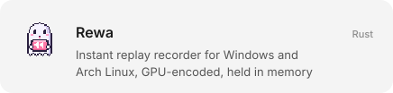
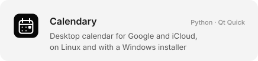
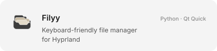
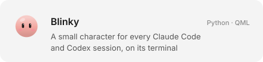
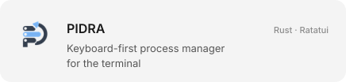
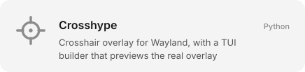

<picture>
  <source media="(prefers-color-scheme: dark)" srcset="assets/header-dark.svg">
  
</picture>

## Mika

Local-first desktop software for Linux and Windows, written in Rust, Python with Qt Quick, and C++.
I build tools I use myself, and I keep them small.

### Projects

<a href="https://github.com/mikaeww/Rewa"><picture><source media="(prefers-color-scheme: dark)" srcset="assets/cards/rewa-dark.svg"></picture></a>
<a href="https://github.com/mikaeww/calendary"><picture><source media="(prefers-color-scheme: dark)" srcset="assets/cards/calendary-dark.svg"></picture></a>
<a href="https://github.com/mikaeww/filyy"><picture><source media="(prefers-color-scheme: dark)" srcset="assets/cards/filyy-dark.svg"></picture></a>
<a href="https://github.com/mikaeww/blinky"><picture><source media="(prefers-color-scheme: dark)" srcset="assets/cards/blinky-dark.svg"></picture></a>
<a href="https://github.com/mikaeww/PIDRA"><picture><source media="(prefers-color-scheme: dark)" srcset="assets/cards/pidra-dark.svg"></picture></a>
<a href="https://github.com/mikaeww/Crosshype"><picture><source media="(prefers-color-scheme: dark)" srcset="assets/cards/crosshype-dark.svg"></picture></a>

### Open source

- Ported [**boltsnap**](https://github.com/drvcvt/boltsnap) and [**eddy**](https://github.com/drvcvt/eddy) to Windows: native capture, MSI and NSIS installers, release CI
- 18 merged pull requests, 6 of them in other people's repositories

Header and cards are drawn by [`scripts/build-profile.py`](scripts/build-profile.py); the terminal shows a real run of Blinky's checks.
